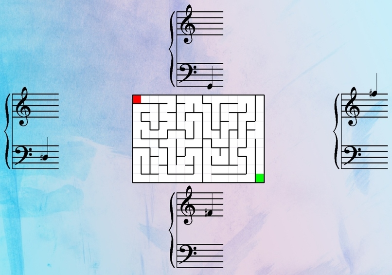

# Music-Maze
Hack@Brown 2021 hackathon project

## What it does
Music Maze is a maze game that is controlled by reading notes on a staff and playing the correct note into your microphone.

## How we built it
Music Maze was coded in Python. [Pygame](https://www.pygame.org/) was used for the visual aspect and [Aubio](https://aubio.org/) library was used to determine the pitch of the note being played.

## How to play
When the game is started, there will be a maze in the center and 4 different grand staffs. The location of the staff represents which note should be played to move in a certain direction.  After playing one of the notes, if possible, the RED square will move in that direction. The goal is to get the RED square to the GREEN square.

